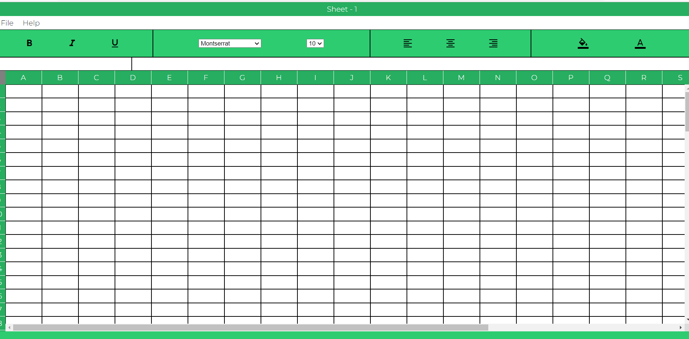
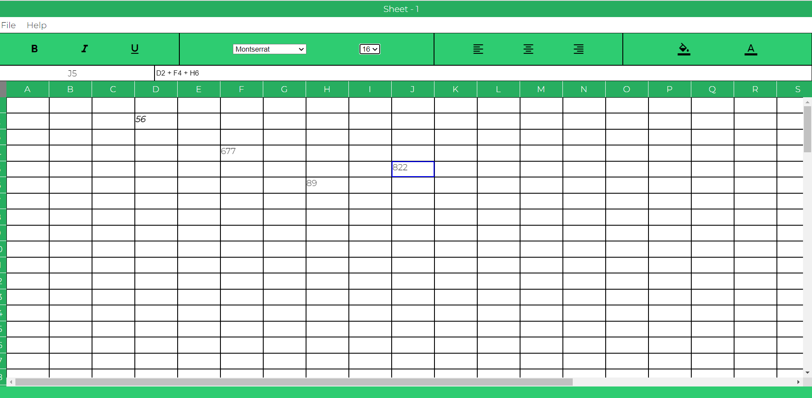
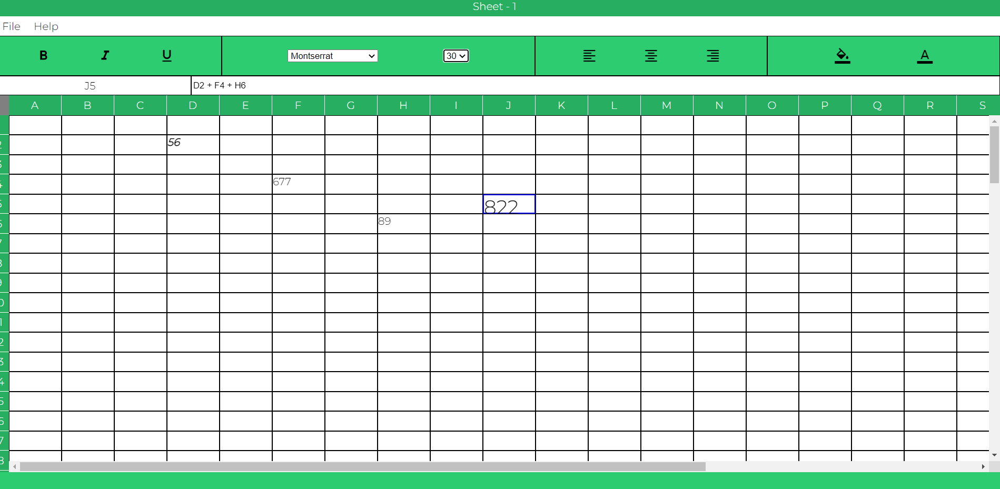
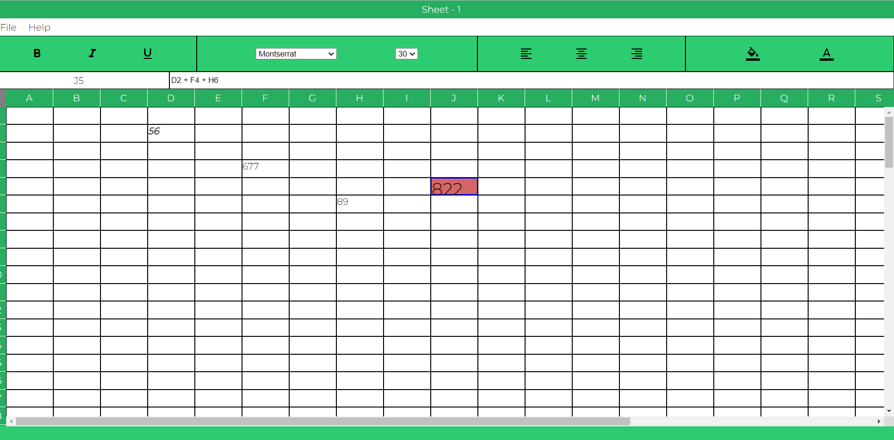
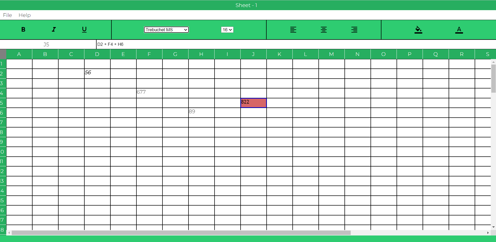
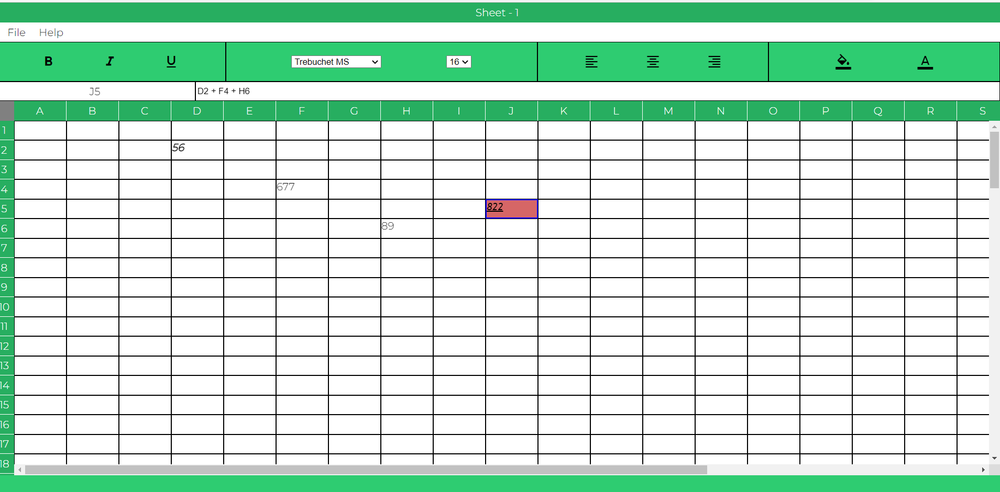

# [Excel Clone](https://nikhil00shinde.github.io/Excel-Clone/)

## Features

> - Implemented the Eval function, cycle detection (Using directed- Graph Data Structure) and set Formula for each cell.
> - Used local Storage for Storing User data. Add text formatting (Bold, Italic, underline, font-size, font-style), alignments,font and background colors to different selected cells.

## Tech Stack Used

> - HTML
> - CSS
> - Javascript

## Screenshot

> Home
> 

> Adding Formula in Formula Bar
> 

> Changing Font Size
> 

> Adding BackgroundColor
> 

> Changing Font Style
> 

> Underline Cell
> 
